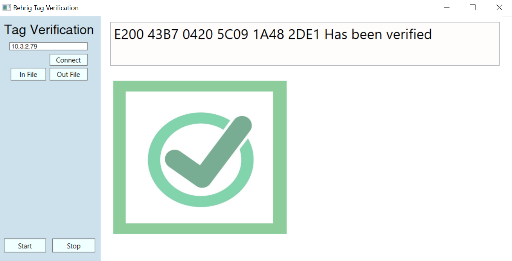

# tag-verifier
A Desktop Application that Verifies RFID tag EPC's when they become shipped in a roll.
  
 
## Usage
- To Use this you will need 
  - an Impinj Reader
  - RFID Tags
 
 - to use you connect the reader to the application using the Connect button and host name
 - select both a:
  - input file (in file)
  - output file (out file)
 - start reading tags by pressing ( start )
 - when finished press stop and the application will Save the contents of the verified tags to a CSV file.
 
 ## Technologies used:
 Language: C#
 Tools: WPF, Impinj SDK, and my brain. ( but mostly google and stack overflow )
 
 ## License
 Look at the LICENSE.md file
 
 thanks!
